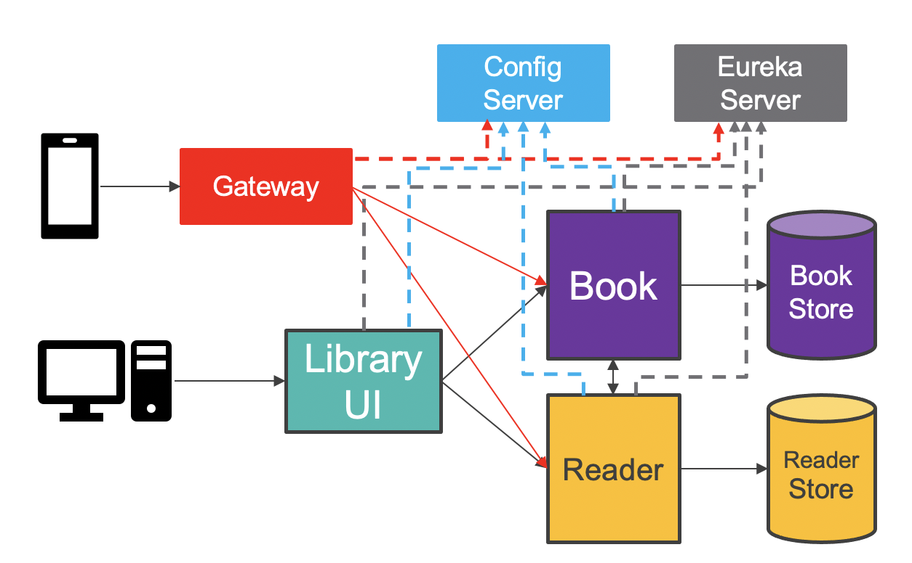

# Example of microservice-based application running on Tanzu Application Service (Former Pivotal Cloud Foundry)
 
This demo aims to show the power of Tanzu Application Service (TAS) platfom when it comes to run microservices developed using <a href="https://spring.io/projects/spring-cloud">Spring Cloud</a> projects: <b>Spring Cloud Netflix</b>, <b>Spring Cloud OpenFeign</b>, <b>Spring Cloud Config</b> and <b>Spring Cloud Gateway</b>.
 
 
 
 
Each service binds to Eureka Server to discover all the others and start automatically using <i>client-side load balancing</i> through OpenFeign. The front-end service will configure accordingly its home page when running on Tanzu Application Service (TAS). 
Different Application Instances (AIs) will render the UI using different background colors, up to 4 different colors. 
 
You can generate 10 readers at a time clicking on the <i>Load Readers</i> button. 
You can generate 100 books at a time clicking on the <i>Load Books</i> button. The first 40 books will evenly be assigned to some readers. 
You can visualise the list of readers and books following the corresponding links. Use the browser's back buttom to return to the home page. 

<h2>Testing locally:</h2>
Run the following commands to start up everything:
<code>java -jar configserver/build/libs/configserver-1.0.0.jar</code> 
<code>java -jar registry/build/libs/registry-1.0.0.jar</code> 
<code>java -jar application/build/libs/application-1.0.0.jar</code> 
<code>java -jar book/build/libs/book-1.0.0.jar</code> 
<code>java -jar reader/build/libs/reader-1.0.0.jar</code> 

<ins>URL:</ins> 
localhost:8080

<h2>Testing on the cloud:</h2>
1. Install all required services and push the applications on TAS running the <code>./scripts/init.sh</code>command. 
 
2. Use the published route to access the application running on TAS. You will notice that the home page looks different now. The application has detected it is running on TAS :)  
<ins>URL:</ins> 
<code>http://library-msa.cfapps.io</code> 
 
3. Generate some data clicking on <i>Load Readers</i> and <i>Load Books</i> buttons. 
 
4. Scale out the front-end application via the <code>cf scale app library-msa -i 3</code>command. 
 
You will notice that all AIs show consistent lists of readers and books as both <b>Reader</b> and <b>Book</b> services are using backing database services bound to them. 
 
5. Stop the <b>Reader</b> service instance using the <code>cf stop library-reader-service</code> command. 
 
6. You can verify that the <b>Reader</b> service instance is gone clicking on the <i>List of Readers</i> link on the home page. The list shows up empty. 
 
7. Navigate to the <i>List of Books</i> page. Borrow a book to some reader who hasn't yet borrowed any books. The operation is to succeed despite the <b>Reader</b> service being down. This is the <i>circuit breaker pattern</i> in action. 
 
8. You can access the back-end services RESTful APIs via the <b>API Gateway</b>. For example, retrieve the list of books using the <code>http library-gtw.cfapps.io/library-book-service/books</code> command.

<h2>Cleaning up:</h2>
 
9. <code>./scripts/cleanup.sh</code> 

<h2>Architectural Decisions:</h2>
 
1) The application follows the microservice architecture pattern and the back-end services expose RESTful APIs. The front-end service implements the Model-View-Controller (MVC) architectural pattern which is made easy by the Spring framework.  
 
2) The front-end service can easily consume the RESTful APIs thanks to the declarative model offered by the Spring Cloud OpenFeign library. 
 
3) This microservice architecture leverages a <b>service registry</b>, <b>config server</b> and <b>API gateway</b>, all of them implemented using the Spring Cloud project. 
 
4) SQL databases have been chosen as data stores. The default implementations of both <b>Reader</b> and <b>Book</b> services are the H2 embedded in-memory database when running locally. 

