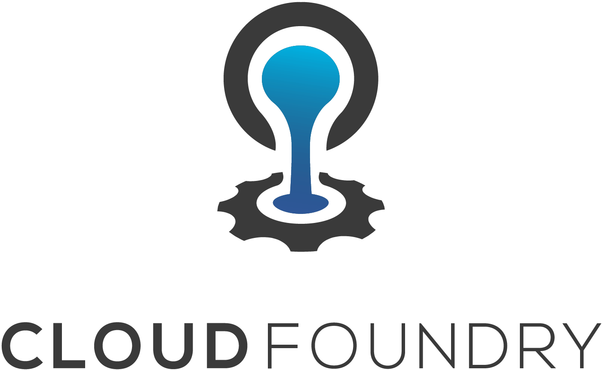

  
# Example of microservice-based application running on...
  
  
This demo aims to show the power of Cloud Foundry platfom when it comes to run microservices developed using [Spring Cloud](https://spring.io/projects/spring-cloud) umbrella project:  **Spring Cloud Netflix**, **Spring Cloud OpenFeign**, **Spring Cloud Config** and **Spring Cloud Gateway**.  
  
  
  
Each service binds to Eureka Server to discover all the others and start automatically using *client-side load balancing* through OpenFeign. The front-end service will configure accordingly its home page when running on Tanzu Application Service (TAS).  
Different Application Instances (AIs) will render the UI using different background colors, up to 4 different colors.  
  
You can generate 10 readers at a time clicking on the *Load Readers* button.  
You can generate 100 books at a time clicking on the *Load Books* button. The first 40 books will evenly be assigned to some readers.  
You can visualise the list of readers and books following the corresponding links. Use the browser's back buttom to return to the home page.  
  


## Testing locally:
The build process requires that your workstation have Maven installed to used by the Spring Cloud Contract project. Execute the `./scripts/build.sh` script to build everything.  
  
Run the following commands to start everything up:  
```bash
java -jar configserver/build/libs/configserver-1.0.0.jar
java -jar registry/build/libs/registry-1.0.0.jar
java -jar gateway/build/libs/gateway-1.0.0.jar
java -jar application/build/libs/application-1.0.0.jar
java -jar book/build/libs/book-1.0.0.jar
java -jar reader/build/libs/reader-1.0.0.jar
```

__URL:__  
`localhost:8080`

## Testing in the cloud:

*IMPORTANT NOTICE:*  
The scripts require **cf CLI V7**.

1. Install all required services and push the applications on TAS running the `./scripts/init.sh` script. If you just want to test the API gateway integrated with **Tanzu API Portal** without databases being provisioned, run instead the `./scripts/init-api.sh <path-to-api-portal-jar-file>` script, passing in the path to the API Portal jar file downloaded from the Tanzu Network.  

1. Use the published route to access the application running on TAS. You will notice that the home page looks different now. The application has detected it is running on TAS :)  
__URL:__  
`https://library-msa.<apps-domain>/`
1. Generate some data clicking on *Load Readers* and *Load Books* buttons.
1. Scale out the front-end application via the `cf scale app library-msa -i 3` command.
1. Stop the **Reader** service instance using the `cf stop library-reader-service` command.
1. You can verify that the **Reader** service instance is gone clicking on the *List of Readers* link on the home page. The list shows up empty.
1. Navigate to the *List of Books* page. Borrow a book to some reader who hasn't yet borrowed any books. The operation is to succeed despite the **Reader** service being down. This is the *circuit breaker pattern* in action.
1. You can access the back-end services RESTful APIs via the **API Gateway**. For example, retrieve the list of books using the `http https://library-gtw.<apps-domain>/library-book-service/books` command.
1. (Optional) If you installed the **API Portal** on step 1, now you can access it at the `https://api.<apps-domain>/` route.

## Cleaning up:
  
10. Run either `./scripts/cleanup.sh` or `./scripts/cleanup-api.sh` script depending on whether or not you deployed the **API Portal** on step 1.  
  
## Architectural Decisions:
  
1. The application follows the microservice architecture pattern and the back-end services expose RESTful APIs. The front-end service implements the Model-View-Controller (MVC) architectural pattern which is made easy by the Spring framework.  

1. The front-end service can easily consume the RESTful APIs thanks to the declarative model offered by the Spring Cloud OpenFeign library.  

1. This microservice architecture leverages a **service registry**, **config server** and **API gateway**, all of them implemented using the Spring Cloud umbrella project.  

1. SQL databases have been chosen as data stores. Both **Reader** and **Book** services use H2 embedded in-memory database by default when running locally.
